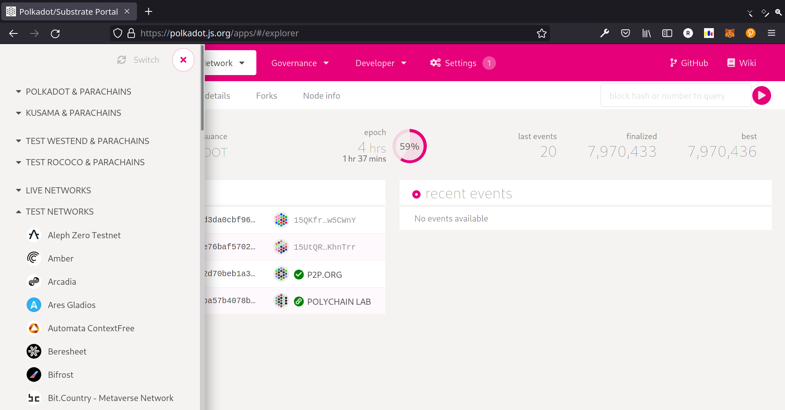
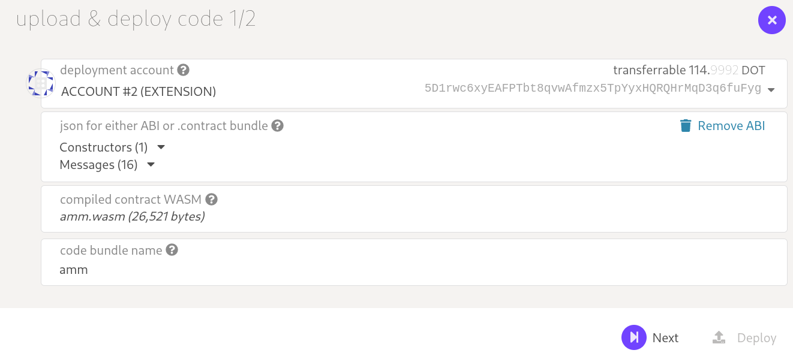
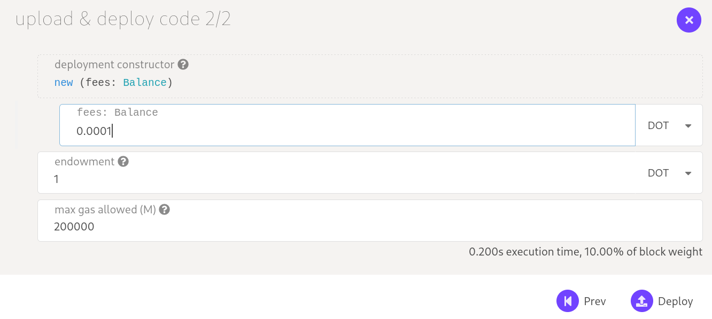
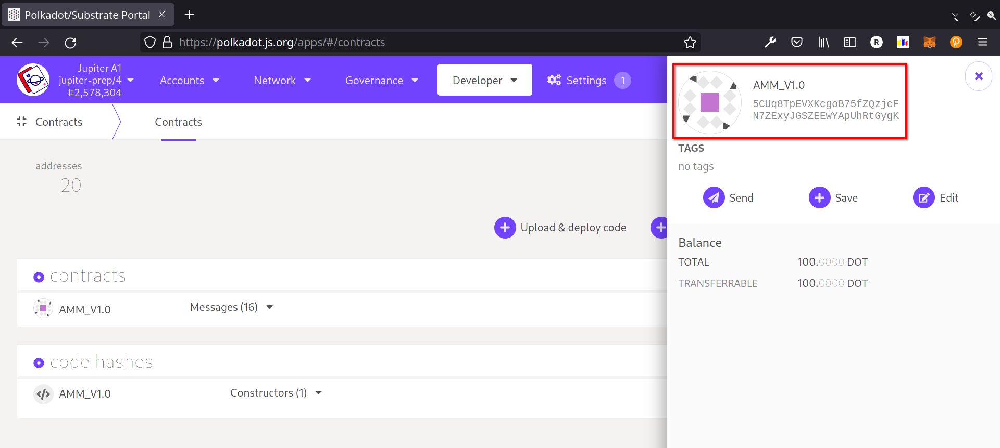
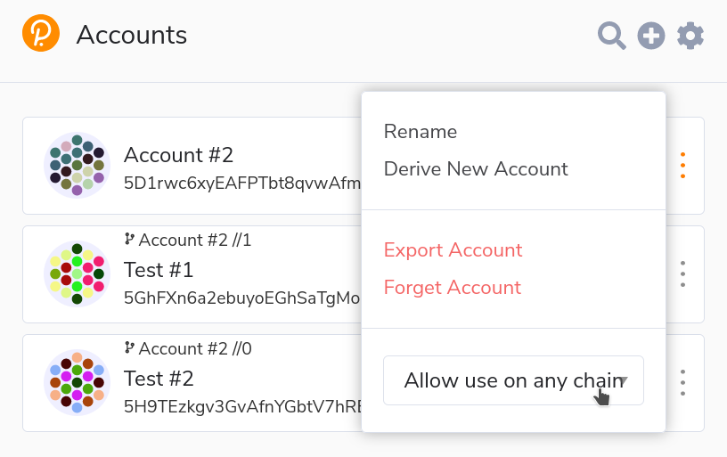

# Introduction

In this tutorial, we will learn how to build an AMM having features - Provide, Withdraw & Swap with trading fees & slippage tolerance. We will build the smart contract in ink! (a rust based eDSL language) and then see how to deploy it on a public testnet and will create our frontend in ReactJS.

# Prerequisites

* Should be familiar with Rust and ReactJS
* Have gone through [ink! beginners guide](https://docs.substrate.io/tutorials/v3/ink-workshop/pt1/)

# Requirements

* [Node.js](https://nodejs.org/en/download/releases/) v10.18.0+
* [Polkadot{.js} extension](https://polkadot.js.org/extension/) on your browser
* [Ink! v3 setup](https://paritytech.github.io/ink-docs/getting-started/setup)

# What's an AMM?

Automated Market Maker(AMM) is a type of decentralized exchange which is based on a mathematical formula of price assets. It allows digital assets to be traded without any permissions and automatically by using liquidity pools instead of any traditional buyers and sellers which uses an order book that was used in traditional exchange, here assets are priced according to a pricing algorithm. 

For example, Uniswap uses p * q = k, where p is the amount of one token in the liquidity pool, and q is the amount of the other. Here “k” is a fixed constant which means the pool’s total liquidity always has to remain the same. For further explanation let us take an example if an AMM has coin A and Coin B, two volatile assets, every time A is bought, the price of A goes up as there is less A in the pool than before the purchase. Conversely, the price of B goes down as there is more B in the pool. The pool stays in constant balance, where the total value of A in the pool will always equal the total value of B in the pool. The size will expand only when new liquidity providers join the pool.

# Implementing the smart contract

Move to the directory where you want to create your ink! project and run the following command in the terminal which will create a template ink! project for you.

```text
cargo contract new amm
```

Move inside the `amm` folder and replace the content of `lib.rs` file with the following code. We have broken down the implementation into 10 parts.

```rust
#![cfg_attr(not(feature = "std"), no_std)]
#![allow(non_snake_case)]

use ink_lang as ink;
const PRECISION: u128 = 1_000_000; // Precision of 6 digits

#[ink::contract]
mod amm {
    use ink_storage::collections::HashMap;

    // Part 1. Define Error enum 

    // Part 2. Define storage struct 

    // Part 3. Helper functions 

    impl Amm {
        // Part 4. Constructor

        // Part 5. Faucet

        // Part 6. Read current state

        // Part 7. Provide

        // Part 8. Withdraw

        // Part 9. Swap
    }

    // Part 10. Unit Testing
}
```

## Part 1. Define Error enum

The `Error` enum will contain all the error values that our contract throws. Ink! requires returned values to have certain traits. So we are deriving them for our custom enum type with the `#[derive(...)]` attribute.

```rust
#[derive(Debug, PartialEq, Eq, scale::Encode, scale::Decode)]
#[cfg_attr(feature = "std", derive(scale_info::TypeInfo))]
pub enum Error {
    /// Zero Liquidity
    ZeroLiquidity,
    /// Amount cannot be zero!
    ZeroAmount,
    /// Insufficient amount
    InsufficientAmount,
    /// Equivalent value of tokens not provided
    NonEquivalentValue,
    /// Asset value less than threshold for contribution!
    ThresholdNotReached,
    /// Share should be less than totalShare
    InvalidShare,
    /// Insufficient pool balance
    InsufficientLiquidity,
    /// Slippage tolerance exceeded
    SlippageExceeded,
}
```

## Part 2. Define storage struct

Next, we define the state variables needed to operate the AMM. We will be using the same mathematical formula as used by Uniswap to determine the price of the assets (**K = totalToken1 * totalToken2**). For simplicity purposes, We are maintaining our own internal balance mapping (token1Balance & token2Balance) instead of dealing with external tokens.

```rust
#[derive(Default)]
#[ink(storage)]
pub struct Amm {
    totalShares: Balance, // Stores the total amount of share issued for the pool
    totalToken1: Balance, // Stores the amount of Token1 locked in the pool
    totalToken2: Balance, // Stores the amount of Token2 locked in the pool
    shares: HashMap<AccountId, Balance>, // Stores the share holding of each provider
    token1Balance: HashMap<AccountId, Balance>, // Stores the token1 balance of each user
    token2Balance: HashMap<AccountId, Balance>, // Stores the token2 balance of each user
    fees: Balance,        // Percent of trading fees charged on trade
}
```

## Part 3. Helper functions

We will define the private functions in a separate implementation block to keep the code structure clean and we need to add the `#[ink(impl)]` attribute to make ink! aware of it. The following functions will be used to check the validity of the parameters passed to the functions and restrict certain activities when the pool is empty.

```rust
#[ink(impl)]
impl Amm {
    // Ensures that the _qty is non-zero and the user has enough balance
    fn validAmountCheck(
        &self,
        _balance: &HashMap<AccountId, Balance>,
        _qty: Balance,
    ) -> Result<(), Error> {
        let caller = self.env().caller();
        let my_balance = *_balance.get(&caller).unwrap_or(&0);

        match _qty {
            0 => Err(Error::ZeroAmount),
            _ if _qty > my_balance => Err(Error::InsufficientAmount),
            _ => Ok(()),
        }
    }

    // Returns the liquidity constant of the pool
    fn getK(&self) -> Balance {
        self.totalToken1 * self.totalToken2
    }

    // Used to restrict withdraw & swap feature till liquidity is added to the pool
    fn activePool(&self) -> Result<(), Error> {
        match self.getK() {
            0 => Err(Error::ZeroLiquidity),
            _ => Ok(()),
        }
    }
}
```

## Part 4. Constructor

Our constructor takes `_fees` as a parameter that determines the percent of fees the user is charged when doing a swap operation. The value of `_fees` should be between 0 and 1000(exclusive). Then any swap operation will be charged **_fees/1000** percent of the amount deposited.

```rust
/// Constructs a new AMM instance
/// @param _fees: valid interval -> [0,1000)
#[ink(constructor)]
pub fn new(_fees: Balance) -> Self {
    // Sets fees to zero if not in valid range
    Self {
        fees: if _fees >= 1000 { 0 } else { _fees },
        ..Default::default()
    }
}
```

## Part 5. Faucet

As we are not using the external tokens and instead, maintaining a record of the balance ourselves; we need a way to allocate tokens to the new users so that they can interact with the dApp. Users can call the faucet function to get some tokens to play with!

```rust
/// Sends free token(s) to the invoker
#[ink(message)]
pub fn faucet(&mut self, _amountToken1: Balance, _amountToken2: Balance) {
    let caller = self.env().caller();
    let token1 = *self.token1Balance.get(&caller).unwrap_or(&0);
    let token2 = *self.token2Balance.get(&caller).unwrap_or(&0);

    self.token1Balance.insert(caller, token1 + _amountToken1);
    self.token2Balance.insert(caller, token2 + _amountToken2);
}
```

## Part 6. Read current state

The following functions are used to get the present state of the smart contract.

```rust
/// Returns the balance of the user
#[ink(message)]
pub fn getMyHoldings(&self) -> (Balance, Balance, Balance) {
    let caller = self.env().caller();
    let token1 = *self.token1Balance.get(&caller).unwrap_or(&0);
    let token2 = *self.token2Balance.get(&caller).unwrap_or(&0);
    let myShares = *self.shares.get(&caller).unwrap_or(&0);
    (token1, token2, myShares)
}

/// Returns the amount of tokens locked in the pool,total shares issued & trading fee param
#[ink(message)]
pub fn getPoolDetails(&self) -> (Balance, Balance, Balance, Balance) {
    (
        self.totalToken1,
        self.totalToken2,
        self.totalShares,
        self.fees,
    )
}
```

## Part 7. Provide

`provide` function takes two parameters - the amount of token1 & the amount of token2 that the user wants to lock in the pool. If the pool is initially empty then the equivalence rate is set as **_amountToken1 : _amountToken2** and the user is issued 100 shares for it. Otherwise, it is checked whether the two amounts provided by the user have equivalent value or not. This is done by checking if the two amounts are in equal proportion to the total number of their respective token locked in the pool i.e. **_amountToken1 : totalToken1 : : _amountToken2 : totalToken2** should hold.

```rust
/// Adding new liquidity in the pool
/// Returns the amount of share issued for locking given assets
#[ink(message)]
pub fn provide(
    &mut self,
    _amountToken1: Balance,
    _amountToken2: Balance,
) -> Result<Balance, Error> {
    self.validAmountCheck(&self.token1Balance, _amountToken1)?;
    self.validAmountCheck(&self.token2Balance, _amountToken2)?;

    let share;
    if self.totalShares == 0 {
        // Genesis liquidity is issued 100 Shares
        share = 100 * super::PRECISION;
    } else {
        let share1 = self.totalShares * _amountToken1 / self.totalToken1;
        let share2 = self.totalShares * _amountToken2 / self.totalToken2;

        if share1 != share2 {
            return Err(Error::NonEquivalentValue);
        }
        share = share1;
    }

    if share == 0 {
        return Err(Error::ThresholdNotReached);
    }

    let caller = self.env().caller();
    let token1 = *self.token1Balance.get(&caller).unwrap();
    let token2 = *self.token2Balance.get(&caller).unwrap();
    self.token1Balance.insert(caller, token1 - _amountToken1);
    self.token2Balance.insert(caller, token2 - _amountToken2);

    self.totalToken1 += _amountToken1;
    self.totalToken2 += _amountToken2;
    self.totalShares += share;
    self.shares
        .entry(caller)
        .and_modify(|val| *val += share)
        .or_insert(share);

    Ok(share)
}
```

The given functions help the user get an estimate of the amount of the second token that they need to lock for the given token amount. Here again, we use the proportion **_amountToken1 : totalToken1 : : _amountToken2 : totalToken2** to determine the amount of token1 required if we wish to lock given amount of token2 and vice-versa.

```rust
/// Returns amount of Token1 required when providing liquidity with _amountToken2 quantity of Token2
#[ink(message)]
pub fn getEquivalentToken1Estimate(
    &self,
    _amountToken2: Balance,
) -> Result<Balance, Error> {
    self.activePool()?;
    Ok(self.totalToken1 * _amountToken2 / self.totalToken2)
}

/// Returns amount of Token2 required when providing liquidity with _amountToken1 quantity of Token1
#[ink(message)]
pub fn getEquivalentToken2Estimate(
    &self,
    _amountToken1: Balance,
) -> Result<Balance, Error> {
    self.activePool()?;
    Ok(self.totalToken2 * _amountToken1 / self.totalToken1)
}
```

## Part 8. Withdraw

Withdraw is used when a user wishes to burn a given amount of share to get back their tokens. Token1 and Token2 are released from the pool in proportion to the share burned with respect to total shares issued i.e. **share : totalShare : : amountTokenX : totalTokenX**.

```rust
/// Returns the estimate of Token1 & Token2 that will be released on burning given _share
#[ink(message)]
pub fn getWithdrawEstimate(&self, _share: Balance) -> Result<(Balance, Balance), Error> {
    self.activePool()?;
    if _share > self.totalShares {
        return Err(Error::InvalidShare);
    }

    let amountToken1 = _share * self.totalToken1 / self.totalShares;
    let amountToken2 = _share * self.totalToken2 / self.totalShares;
    Ok((amountToken1, amountToken2))
}

/// Removes liquidity from the pool and releases corresponding Token1 & Token2 to the withdrawer
#[ink(message)]
pub fn withdraw(&mut self, _share: Balance) -> Result<(Balance, Balance), Error> {
    let caller = self.env().caller();
    self.validAmountCheck(&self.shares, _share)?;

    let (amountToken1, amountToken2) = self.getWithdrawEstimate(_share)?;
    self.shares.entry(caller).and_modify(|val| *val -= _share);
    self.totalShares -= _share;

    self.totalToken1 -= amountToken1;
    self.totalToken2 -= amountToken2;

    self.token1Balance
        .entry(caller)
        .and_modify(|val| *val += amountToken1);
    self.token2Balance
        .entry(caller)
        .and_modify(|val| *val += amountToken2);

    Ok((amountToken1, amountToken2))
}
```

## Part 9. Swap

To swap from Token1 to Token2 we will implement four functions - `getSwapToken1EstimateGivenToken1`, `getSwapToken1EstimateGivenToken2`, `swapToken1GivenToken1` & `swapToken1GivenToken2`. The first two functions only determine the values of swap for estimation purposes while the last two do the actual conversion.

`getSwapToken1EstimateGivenToken1` returns the amount of token2 that the user will get when depositing a given amount of token1. The amount of token2 is obtained from the equation **K = totalToken1 * totalToken2** and **K = (totalToken1 + delta * amountToken1) * (totalToken2 - amountToken2)** where **delta** is **(1000 - fees)/1000**. Therefore **delta \* amountToken1** is the adjusted token1Amount for which the resultant amountToken2 is calculated and rest of token1Amount goes into the pool as trading fees. We get the value **amountToken2** from solving the above equation.

```rust
/// Returns the amount of Token2 that the user will get when swapping a given amount of Token1 for Token2
#[ink(message)]
pub fn getSwapToken1EstimateGivenToken1(
    &self,
    _amountToken1: Balance,
) -> Result<Balance, Error> {
    self.activePool()?;
    let _amountToken1 = (1000 - self.fees) * _amountToken1 / 1000; // Adjusting the fees charged

    let token1After = self.totalToken1 + _amountToken1;
    let token2After = self.getK() / token1After;
    let mut amountToken2 = self.totalToken2 - token2After;

    // To ensure that Token2's pool is not completely depleted leading to inf:0 ratio
    if amountToken2 == self.totalToken2 {
        amountToken2 -= 1;
    }
    Ok(amountToken2)
}
```

`getSwapToken1EstimateGivenToken2` returns the amount of token1 that the user should deposit to get a given amount of token2. Amount of token1 is similarly obtained by solving the following equation **K = (totalToken1 + delta * amountToken1) * (totalToken2 - amountToken2)** for **amountToken1**.

```rust
/// Returns the amount of Token1 that the user should swap to get _amountToken2 in return
#[ink(message)]
pub fn getSwapToken1EstimateGivenToken2(
    &self,
    _amountToken2: Balance,
) -> Result<Balance, Error> {
    self.activePool()?;
    if _amountToken2 >= self.totalToken2 {
        return Err(Error::InsufficientLiquidity);
    }

    let token2After = self.totalToken2 - _amountToken2;
    let token1After = self.getK() / token2After;
    let amountToken1 = (token1After - self.totalToken1) * 1000 / (1000 - self.fees);
    Ok(amountToken1)
}
```

`swapToken1GivenToken1` takes the amount of Token1 that needs to be swapped for some Token2. To handle slippage, we take input the minimum Token2 that the user wants for a successful trade. If the expected Token2 is less than the threshold then the Tx is reverted.

```rust
/// Swaps given amount of Token1 to Token2 using algorithmic price determination
/// Swap fails if Token2 amount is less than _minToken2
#[ink(message)]
pub fn swapToken1GivenToken1(
    &mut self,
    _amountToken1: Balance,
    _minToken2: Balance,
) -> Result<Balance, Error> {
    let caller = self.env().caller();
    self.validAmountCheck(&self.token1Balance, _amountToken1)?;

    let amountToken2 = self.getSwapToken1EstimateGivenToken1(_amountToken1)?;
    if amountToken2 < _minToken2 {
        return Err(Error::SlippageExceeded);
    }
    self.token1Balance
        .entry(caller)
        .and_modify(|val| *val -= _amountToken1);

    self.totalToken1 += _amountToken1;
    self.totalToken2 -= amountToken2;

    self.token2Balance
        .entry(caller)
        .and_modify(|val| *val += amountToken2);
    Ok(amountToken2)
}
```

`swapToken1GivenToken2` takes the amount of Token2 that the user wants to receive and specifies the maximum amount of Token1 she is willing to exchange for it. If the required amount of Token1 exceeds the limit then the swap is cancelled.

```rust
/// Swaps given amount of Token1 to Token2 using algorithmic price determination
/// Swap fails if amount of Token1 required to obtain _amountToken2 exceeds _maxToken1
#[ink(message)]
pub fn swapToken1GivenToken2(
    &mut self,
    _amountToken2: Balance,
    _maxToken1: Balance,
) -> Result<Balance, Error> {
    let caller = self.env().caller();
    let amountToken1 = self.getSwapToken1EstimateGivenToken2(_amountToken2)?;
    if amountToken1 > _maxToken1 {
        return Err(Error::SlippageExceeded);
    }
    self.validAmountCheck(&self.token1Balance, amountToken1)?;

    self.token1Balance
        .entry(caller)
        .and_modify(|val| *val -= amountToken1);

    self.totalToken1 += amountToken1;
    self.totalToken2 -= _amountToken2;

    self.token2Balance
        .entry(caller)
        .and_modify(|val| *val += _amountToken2);
    Ok(amountToken1)
}
```

Similarly for Token2 to Token1 swap we need to implement four functions - `getSwapToken2EstimateGivenToken2`, `getSwapToken2EstimateGivenToken1`, `swapToken2GivenToken2` & `swapToken2GivenToken1`. This is left as an exercise for you to implement :)

Congrats!! on completing the implementation of the smart contract. The complete code can be found at [contract/lib.rs](contract/lib.rs).

## Part 10. Unit Testing

Now let's write some unit tests to make sure our program is working as intended. Module(s) marked with `#[cfg(test)]` attribute tells rust to run the following code when `cargo test` command is executed. Test functions are marked with attribute `#[ink::test]` when we want ink! to inject environment variables like `caller` during the contract invocation.

```rust
#[cfg(test)]
mod tests {
    use super::*;
    use ink_lang as ink;

    #[ink::test]
    fn new_works() {
        let contract = Amm::new(0);
        assert_eq!(contract.getMyHoldings(), (0, 0, 0));
        assert_eq!(contract.getPoolDetails(), (0, 0, 0, 0));
    }

    #[ink::test]
    fn faucet_works() {
        let mut contract = Amm::new(0);
        contract.faucet(100, 200);
        assert_eq!(contract.getMyHoldings(), (100, 200, 0));
    }

    #[ink::test]
    fn zero_liquidity_test() {
        let contract = Amm::new(0);
        let res = contract.getEquivalentToken1Estimate(5);
        assert_eq!(res, Err(Error::ZeroLiquidity));
    }

    #[ink::test]
    fn provide_works() {
        let mut contract = Amm::new(0);
        contract.faucet(100, 200);
        let share = contract.provide(10, 20).unwrap();
        assert_eq!(share, 100_000_000);
        assert_eq!(contract.getPoolDetails(), (10, 20, share, 0));
        assert_eq!(contract.getMyHoldings(), (90, 180, share));
    }

    #[ink::test]
    fn withdraw_works() {
        let mut contract = Amm::new(0);
        contract.faucet(100, 200);
        let share = contract.provide(10, 20).unwrap();
        assert_eq!(contract.withdraw(share / 5).unwrap(), (2, 4));
        assert_eq!(contract.getMyHoldings(), (92, 184, 4 * share / 5));
        assert_eq!(contract.getPoolDetails(), (8, 16, 4 * share / 5, 0));
    }

    #[ink::test]
    fn swap_works() {
        let mut contract = Amm::new(0);
        contract.faucet(100, 200);
        let share = contract.provide(50, 100).unwrap();
        let amountToken2 = contract.swapToken1GivenToken1(50, 50).unwrap();
        assert_eq!(amountToken2, 50);
        assert_eq!(contract.getMyHoldings(), (0, 150, share));
        assert_eq!(contract.getPoolDetails(), (100, 50, share, 0));
    }

    #[ink::test]
    fn slippage_works() {
        let mut contract = Amm::new(0);
        contract.faucet(100, 200);
        let share = contract.provide(50, 100).unwrap();
        let amountToken2 = contract.swapToken1GivenToken1(50, 51);
        assert_eq!(amountToken2, Err(Error::SlippageExceeded));
        assert_eq!(contract.getMyHoldings(), (50, 100, share));
        assert_eq!(contract.getPoolDetails(), (50, 100, share, 0));
    }

    #[ink::test]
    fn trading_fees_works() {
        let mut contract = Amm::new(100);
        contract.faucet(100, 200);
        contract.provide(50, 100).unwrap();
        let amountToken2 = contract.getSwapToken1EstimateGivenToken1(50).unwrap();
        assert_eq!(amountToken2, 48);
    }
}
```

From your ink! project directory run the following command in the terminal to run the tests module:

```text
cargo +nightly contract test
```

Next, we will learn how to deploy the contract on a public testnet in the next section.

# Deploying the smart contract

We will deploy our ink! smart contract on Jupiter A1 testnet of Patract ([More info](https://docs.patract.io/en/jupiter/network)). If you wish to deploy on a local node or some other testnet instead, change the `blockchainUrl` variable in [src/constants.js](src/constants.js) file to point to their respective endpoint. 

First, we need to build our ink! project to obtain the necessary artifacts. From your ink! project directory run the following command in the terminal:

```text
cargo +nightly contract build --release
```

This will generate the artifacts at `./target/ink`. We will use the `amm.wasm` and `metadata.json` (*It is the ABI of our contract and it will be needed when we integrate it with the frontend of our dApp*) files to deploy our smart contract.

Next, we need to fund our address to interact with the network. Go to the [faucet](https://patrastore.io/#/jupiter-a1/system/accounts) to get some testnet tokens. 

Now visit [https://polkadot.js.org/apps](https://polkadot.js.org/apps) and switch to the Jupiter testnet. You can do this by clicking on the chain logo available on the top-left of the navbar where you will see a list of available networks. Move to the *"TEST NETWORKS"* section and search for a network called **Jupiter**. Select it and scroll back to the top and click on *Switch*.



After switching the network, Click on the *Contracts* option under the *Developer* tab from the navbar. There click on *Upload & Deploy Code* and select the account through which you wish to deploy and in the field - *"json for either ABI or .contract bundle"* upload the `metadata.json` file. Next a new field - *"compiled contract WASM"* will emerge where you need to upload your wasm file i.e. `amm.wasm` in our case. It will look something like this - 



Now click on *Next*. As we have just one constructor in our contract, It will be chosen by default otherwise a dropdown option would have been present to select from multiple constructors. As our constructor `new()` accepts one parameter called `fees`. We need to set the *fees* field with a positive number. 

  
Note down that the default unit is set to *DOT* which multiplies the input by a factor of 10^4. So if we wish to pass a value say 10 (which corresponds to 1% trading fee, 10/1000 fraction, in our contract) then we need to write 0.0001 DOT.  


Set *endowment* to 1 DOT which transfers 1 DOT to the contract for storage rent. Finally set *max gas allowed (M)* to 200000. It will look something like this - 



Click on *Deploy* followed by *Sign and Submit*. Wait for the Tx to be mined and after a few seconds, you can see the updated contract page with the list of your deployed contracts. Click on the name of your contract to see the contract address and note it down as it will be needed when integrating with the frontend.



# How to interact with polkadot.{js}

In this section, we will see how to interact with our smart contract using polkadot.{js}. Install the required packages 

```text
npm install @polkadot/api @polkadot/api-contract @polkadot/extension-dapp
```

Let's see the following code block, and understand how it works

```javascript
// Imports
import { ApiPromise, WsProvider } from "@polkadot/api";
import {
  web3Accounts,
  web3Enable,
  web3FromSource,
} from "@polkadot/extension-dapp";
import { ContractPromise } from "@polkadot/api-contract";

// Store your contract's ABI
const CONTRACT_ABI = { ... };
// Store contract address
const CONTRACT_ADDRESS = "5EyPH...gXA9g5";

// Create a new instance of contract
const wsProvider = new WsProvider("ws://127.0.0.1:9944");
const api = await ApiPromise.create({ provider: wsProvider });
const contract = new ContractPromise(api, CONTRACT_ABI, CONTRACT_ADDRESS);

// Get available accounts on Polkadot.{js} 
const extensions = await web3Enable("local canvas");
const allAccounts = await web3Accounts();
const selectedAccount = allAccounts[0];

// Create a signer 
const accountSigner = await web3FromSource(selectedAccount.meta.source).then(
  (res) => res.signer
);

// Fetch account holdings and display details (makes a query)
const getAccountHoldings = async () => {
  let holdings = await contract.query
    .getMyHoldings(selectedAccount.address, { value: 0, gasLimit: -1 })
    .then((res) => {
      if (!res?.result?.toHuman()?.Err) return res.output.toHuman();
    });
  console.log("Account Holdings ", holdings);
};

// Fund the account with given amount (makes a transaction)
const faucet = async (amountKAR, amountKOTHI) => {
    await contract.tx
    .faucet({ value: 0, gasLimit: -1 }, amountKAR, amountKOTHI)
    .signAndSend(
      selectedAccount.address,
      { signer: accountSigner },
      (res) => {
        if (res.status.isFinalized) {
          getAccountHoldings();
        }
      }
    );
}
```

In the above javascript code, we have demonstrated how to make a query and transaction to our AMM smart contract. Now let's understand each line of the above code.

```javascript
// Creates a provider
const wsProvider = new WsProvider("ws://127.0.0.1:9944");

// Creates a API instance
const api = await ApiPromise.create({ provider: wsProvider });

// Attach to an existing contract with a known ABI and address.
const contract = new ContractPromise(api, CONTRACT_ABI, CONTRACT_ADDRESS);
```

To interact with the smart contract we need to create an instance of the contract. For that, we first need to make an API instance and any API requires a provider and take a look at the above snippet we create one with **WsProvider**. Next, API creation is done via the **ApiPromise.create** interface. If a provider is not passed to the **ApiPromise.create** it will construct a default WsProvider instance to connect to `ws://127.0.0.1:9944`. 

Finally, we will interact with the deployed contract by making a new instance with the help of the **ContractPromise** interface, it allows us to manage on-chain contracts, make read calls, and execute transactions on contracts.

```javascript
// Retrieves the list of all injected extensions/providers
const extensions = await web3Enable("demo");

// Returns a list of all the injected accounts, accross all extensions 
const allAccounts = await web3Accounts();

// We select the first account in the list
const selectedAccount = allAccounts[0];
```

Now we need to select an account to work with. We can get the list of all injected extensions with **web3Enable**. To get the list of all available accounts we use the help of **web3Accounts**. In the above snippet, we store the first account in a variable **selectedAccount**. 
 
```javascript
// Retrieves the signer interface from this account
// web#FromSource returns an InjectedExtension type
const accountSigner = await web3FromSource(selectedAccount.meta.source).then(
  (res) => res.signer
);
```

To make a transaction we need to retrieve the signer from the account. Now we are all set to interact with the smart contract.  

```javascript
// Fetch account holdings and display details (makes a query)
const getAccountHoldings = async () => {
  let holdings = await contract.query
    .getMyHoldings(selectedAccount.address, { value: 0, gasLimit: -1 })
    .then((res) => {
      if (!res?.result?.toHuman()?.Err) return res.output.toHuman();
    });
  console.log("Account Holdings ", holdings);
};
```

We have created a function **getAccountHoldings**, which makes a query to the **getMyHoldings** method of our smart contract. We pass the account address as the first parameter, 2nd parameter is an object with two keys, **value** only useful on isPayable messages, **gasLimit** sets the maximum gas our query can take. We have set **gasLimit** to **-1**, which indicates the limit is unbounded and can use the maximum available.

```javascript
// Fund the account with given amount (makes a transaction)
const faucet = async (amountKAR, amountKOTHI) => {
    await contract.tx
    .faucet({ value: 0, gasLimit: -1 }, amountKAR, amountKOTHI)
    .signAndSend(
      selectedAccount.address,
      { signer: accountSigner },
      (res) => {
        if (res.status.isFinalized) {
          getAccountHoldings();
        }
      }
    );
}
```

The function faucet makes a transaction to the **faucet** method of our smart contract. We pass the object with **value** and **gasLimit** keys as the first parameter and then we pass the other arguments required for the **faucet** method, the **amountKAR** and **amountKOTHI**. We then sign and send the transaction using the **signAndSend** method. To this method we pass the account address as the first parameter, an object containing the signer as the second parameter, and a callback function that calls the **getAccountHoldings** function when the transaction is Finalized.  

# Creating a frontend in React

Now, we are going to create a react app and set up the front-end of the application. In the frontend, we represent token1 and token2 as KAR and KOTHI respectively.

Open a terminal and navigate to the directory where we will create the application.

```text
cd /path/to/directory
```

Now clone the GitHub repository, move into the newly `polkadot-amm` directory and install all the dependencies.

```text
git clone https://github.com/realnimish/polkadot-amm.git
cd polkadot-amm
npm install
```

In our react application we keep all the React components in the `src/components` directory.

* **BoxTemplate** :- 
It renders the box containing the input field, its header, and the element on the right of the box, which can be a token name account balance, a button, or is empty.

* **FaucetComponent** :-
 Takes amount of token1 (KAR) and token2 (KOTHI) as input and funds the user address with that much amount.

* **ProvideComponent** :-
Takes amount of one token (KAR or KOTHI) fills in the estimated amount of the other token and helps provide liquidity to the pool.

* **SwapComponent** :- 
Helps swap a token to another. It takes the amount of token in input field *From* and estimates the amount of token in input field *To* and vise versa, and also helps set the slippage tolerance while swapping.

* **WithdrawComponent** :-
Helps withdraw the share one has. Also enables them to withdraw to his maximum limit.

* **Account** :-
Shows the pool detail and the account details. It enables to switch between accounts in the application.

* **ContainerComponent** :- 
This component renders the main body of our application which contains the center box, the tabs to switch between the five components Swap, Provide, Faucet, Withdraw, Account.

The `App.js` renders the `ContainerComponent` and connects the application to `polkadot.{js}`. 

The `constants.js` file stores the contract **ABI** and **CONTRACT_ADDRESS**. Don't forget to store your contract address and ABI in the respective variables. 

  
ABI can be obtained from your ink! project folder at `.../target/ink/metadata.json`


Now it's time to run our React app. Use the following command to start the React app.

```text
npm start
```

# Walkthrough


# Conclusion

Congratulations! We have successfully developed a working AMM model where users can swap tokens, provide & withdraw liquidity. As a next step, you can play around with the price formula, integrate the ERC20 standard, and much more...

# Troubleshooting

**Account not showing up**

Make sure that you have added the account on the polkadot{.js} extension and the account visibility is set to either "Allow use on any chain" or "Jupiter A1". You can find this by opening the polkadot{.js} extension and clicking on the hamburger menu of the corresponding account. 



**Ink! project is not building**

The ink! project is in active development because of which our current implementation might become incompatible with future releases. In that case, you can try to modify the contract or shift to ink v3.0.0-rc7.

**Invalid JSON ABI structure supplied, expected a recent metadata version**

Try building the ink! contract using the latest version. If the contract doesn't build on the latest version try deploying on a local node instead.

**ExtrinsicFailed Error while deploying the contract**

Make sure that you are providing a sufficient gas amount for the transaction and have built the contract with `--release` flag as mentioned in the deployment section.

# About the Author(s)  

The tutorial was created by [Sayan Kar](https://github.com/SayanKar) and [Nimish Agrawal](https://github.com/realnimish). You can reach out to them on [Figment Forum](https://community.figment.io/u/nimishagrawal100.in/) for any query regarding the tutorial.

# References

- [How Uniswap works](https://docs.uniswap.org/protocol/V2/concepts/protocol-overview/how-uniswap-works)

- [Constant Product Market Maker](https://github.com/runtimeverification/verified-smart-contracts/blob/uniswap/uniswap/x-y-k.pdf)

- [How to build an AMM on Avalanche](https://github.com/realnimish/avalanche-amm)

- [How to integrate substate contract with frontend](https://github.com/polk4-net/flipper-app)